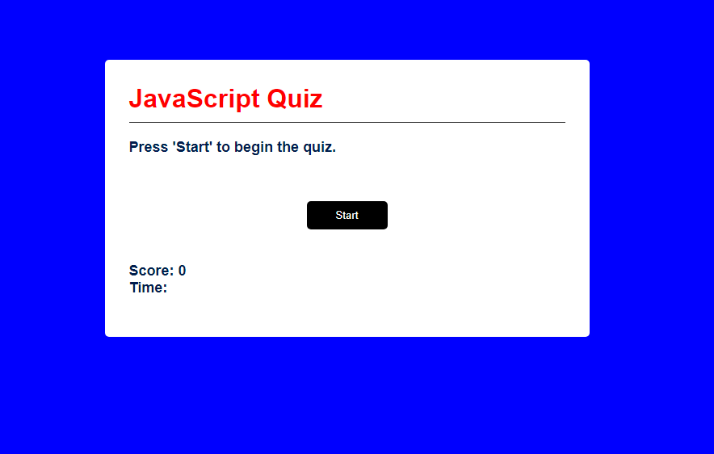

## Coding-Quiz
A quiz to help coders study JavaScript.

## Screenshots

## Usage & Links
Meant to be used like any multiple choice quiz, simply select the best
answer to your knowledge, and if it's correct you'll receive 10 points, and if it's incorrect you don't receive any points. If the timer runs out, you don't receive any points as well.

Link to Quiz: https://timbirict.github.io/Coding-Quiz/

## Sources

Dylan Osborn - Classmate

Joshua Diehl - TA

W3schools.com

Youtube.com

ChatGPT